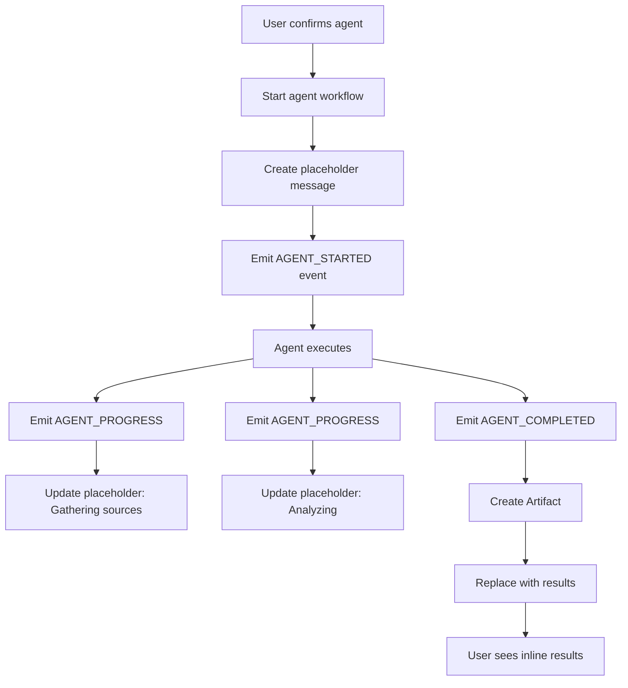

# Agent Orchestration Design: Seamless Chat-Agent Integration

## Vision: "Chat That Creates Chats"

Transform Episteme's chat from a single LLM conversation into an **orchestration layer** that spawns specialized agents while maintaining a unified conversational experience.

---

## Core UX Principle: Progressive Agent Disclosure

```
Simple questions → Direct LLM response
↓
Complex analysis detected → Suggest agent
↓
User accepts → Agent spawns as "sub-conversation"
↓
Agent completes → Results merge back into chat
```

**Key insight from 2026 research**: Don't force users into "agent mode." Let agents emerge naturally when needed, like how Claude Code spawns subagents for complex tasks.

---

## Architecture: Three Interaction Layers

### Layer 1: Chat (Fast, Conversational)
Direct LLM responses for simple questions, clarifications, discussions.

### Layer 2: Agent Suggestions (Intelligent Routing)
System detects when specialized agents would help and offers them inline.

### Layer 3: Agent Execution (Autonomous)
Agents run in background, report progress, inject results back into chat.

---

## Message Flow with Agent Orchestration

```mermaid
sequenceDiagram
    actor User
    participant Chat
    participant Router
    participant LLM
    participant Agent
    participant Skill
    participant Event
    
    User->>Chat: "I need to research FDA requirements"
    Chat->>Router: Analyze intent
    Router->>Router: Detect: research + legal domain
    
    alt Simple Question
        Router->>LLM: Direct response
        LLM-->>Chat: Answer
    else Complex Analysis Needed
        Router-->>Chat: 💡 Suggest Research Agent
        User->>Chat: "Yes, do it"
        Chat->>Event: WORKFLOW_STARTED
        Chat->>Skill: Get active skills for case
        Skill-->>Agent: Inject domain knowledge
        Chat->>Agent: spawn(topic, context)
        Agent-->>Chat: Task ID + status
        
        loop Agent Working
            Agent->>Event: Progress updates
            Chat->>User: Show progress
        end
        
        Agent->>Event: WORKFLOW_COMPLETED
        Agent-->>Chat: Results (blocks)
        Chat->>User: Display inline + create artifact
    end
```



---

## UX Design: Inline Agent Invocation

### Current Flow (Manual, Separate)
```
User chatting → Switch to Artifacts tab → Click "Generate Research" → Fill form → Wait
```

### New Flow (Inline, Seamless)
```
User chatting → Agent suggestion appears → One click → Results inline
```

### Visual Design Concept

```
┌─────────────────────────────────────────────────────┐
│  Chat: FDA Device Approval                          │
├─────────────────────────────────────────────────────┤
│                                                     │
│  You: I need to understand FDA 510(k) requirements  │
│       for our Class II device                       │
│                                                     │
│  ┌──────────────────────────────────────────────┐  │
│  │ 🤖 Suggested Agent                           │  │
│  │                                              │  │
│  │ I can run deep research on this topic using │  │
│  │ your Legal Decision Analysis skill.         │  │
│  │                                              │  │
│  │ Agent: Research                              │  │
│  │ Skill: Legal Decision Analysis              │  │
│  │ Estimate: ~30 seconds                        │  │
│  │                                              │  │
│  │ [Run Research] [Just answer normally]       │  │
│  └──────────────────────────────────────────────┘  │
│                                                     │
│  [User clicks "Run Research"]                       │
│                                                     │
│  🔄 Research Agent working...                       │
│  ├─ Gathering web sources                          │
│  ├─ Analyzing FDA.gov guidance                     │
│  └─ Synthesizing findings                          │
│                                                     │
│  ✓ Research Complete                               │
│  ┌──────────────────────────────────────────────┐  │
│  │ 📊 Research: FDA 510(k) Requirements         │  │
│  │                                              │  │
│  │ ## Executive Summary                         │  │
│  │ The 510(k) pathway is for devices...        │  │
│  │                                              │  │
│  │ ## Key Findings                              │  │
│  │ 1. Substantial equivalence required          │  │
│  │ 2. Timeline: 90-180 days typical            │  │
│  │ [Expand] [Save as Artifact] [Edit]          │  │
│  └──────────────────────────────────────────────┘  │
│                                                     │
│  Assistant: I've completed the research. Based on  │
│            your Legal skill, I prioritized FDA     │
│            statutes and recent guidance. [See above]│
│                                                     │
│  You: Thanks! What are the risks?                  │
│                                                     │
│  ┌──────────────────────────────────────────────┐  │
│  │ 🤖 Suggested Agent                           │  │
│  │ Run Critique Agent to identify risks?        │  │
│  │ [Run Critique] [Answer normally]             │  │
│  └──────────────────────────────────────────────┘  │
└─────────────────────────────────────────────────────┘
```

---

## Agent Trigger Detection (Intent Router)

### Smart Routing Based on Message Patterns

```python
# NEW: Intent Router Service
class AgentRouter:
    """Determines if and which agent should handle a message"""
    
    AGENT_TRIGGERS = {
        'research': [
            r'research|investigate|analyze|study',
            r'what (are|is) the .* (requirements|options|approaches)',
            r'tell me about',
            r'I need to understand'
        ],
        'critique': [
            r'what (are|could be) the (risks|problems|issues)',
            r'challenge|critique|what.*wrong',
            r'devil\'s advocate',
            r'what am I missing'
        ],
        'brief': [
            r'summarize|synthesis|brief me',
            r'what should (I|we) do',
            r'recommendation|decision',
            r'(help me|ready to) decide'
        ]
    }
    
    @staticmethod
    def detect_agent_intent(message: str, context: dict) -> dict:
        """
        Detect if message should trigger an agent
        
        Returns:
            {
                'should_use_agent': bool,
                'suggested_agent': str,  # 'research' | 'critique' | 'brief'
                'confidence': float,
                'reason': str
            }
        """
        import re
        
        message_lower = message.lower()
        
        # Check each agent type
        for agent_type, patterns in AGENT_TRIGGERS.items():
            for pattern in patterns:
                if re.search(pattern, message_lower):
                    return {
                        'should_use_agent': True,
                        'suggested_agent': agent_type,
                        'confidence': 0.8,
                        'reason': f'Message matches {agent_type} pattern'
                    }
        
        # Check context signals
        if context.get('case_has_active_skills'):
            # If case has skills, be more aggressive with agent suggestions
            if len(message.split()) > 20:  # Substantial message
                return {
                    'should_use_agent': True,
                    'suggested_agent': 'research',
                    'confidence': 0.6,
                    'reason': 'Complex message with active skills'
                }
        
        return {
            'should_use_agent': False,
            'suggested_agent': None,
            'confidence': 0.0,
            'reason': 'Simple question, direct LLM response'
        }
```

---

## Integration Points

### Point 1: Assistant Response Workflow (Primary Integration)

**File**: `backend/tasks/workflows.py`

```python
@shared_task
async def assistant_response_workflow(thread_id, user_message_id):
    """
    Enhanced workflow with agent orchestration
    """
    from apps.chat.services import ChatService
    from apps.agents.router import AgentRouter  # NEW
    from apps.agents.orchestrator import AgentOrchestrator  # NEW
    
    thread = await ChatThread.objects.aget(id=thread_id)
    user_message = await Message.objects.aget(id=user_message_id)
    
    # STEP 1: Analyze intent
    context = {
        'thread_has_case': thread.primary_case is not None,
        'case_has_active_skills': False
    }
    
    if thread.primary_case:
        active_skills = await thread.primary_case.active_skills.acount()
        context['case_has_active_skills'] = active_skills > 0
    
    intent = AgentRouter.detect_agent_intent(user_message.content, context)
    
    # STEP 2: Route to agent or direct LLM
    if intent['should_use_agent'] and intent['confidence'] > 0.7:
        # Suggest agent inline
        suggestion = await ChatService.create_assistant_message(
            thread=thread,
            content=f"💡 I can run a {intent['suggested_agent']} agent for this. Would you like me to?",
            metadata={
                'type': 'agent_suggestion',
                'suggested_agent': intent['suggested_agent'],
                'confidence': intent['confidence']
            }
        )
        
        # Wait for user confirmation (handled in next message)
        # Store pending agent request in thread metadata
        thread.metadata = thread.metadata or {}
        thread.metadata['pending_agent'] = intent
        await thread.asave()
        
        return {
            'status': 'agent_suggested',
            'suggestion_message_id': str(suggestion.id)
        }
    
    else:
        # Direct LLM response (existing flow)
        response = await ChatService.generate_assistant_response(thread)
        
        # ... rest of existing workflow (signal extraction, etc.)
```

### Point 2: Agent Confirmation Handler

```python
# In ChatService
async def handle_agent_confirmation(thread: ChatThread, user_message: Message):
    """
    Check if user is responding to agent suggestion
    """
    pending = thread.metadata.get('pending_agent')
    if not pending:
        return None
    
    # Check for affirmative responses
    affirmative = ['yes', 'yeah', 'sure', 'do it', 'go ahead', 'run it', 'please']
    content_lower = user_message.content.lower().strip()
    
    if any(word in content_lower for word in affirmative):
        # User confirmed - spawn agent!
        agent_type = pending['suggested_agent']
        
        # Clear pending
        thread.metadata['pending_agent'] = None
        await thread.asave()
        
        return {
            'confirmed': True,
            'agent_type': agent_type
        }
    
    # User declined or ignored
    if content_lower in ['no', 'nope', 'skip', 'no thanks']:
        thread.metadata['pending_agent'] = None
        await thread.asave()
    
    return None
```

---

## Agent Execution with Progress Updates

### Real-Time Progress in Chat



### Implementation

```python
# NEW: Agent orchestrator
class AgentOrchestrator:
    """Orchestrate agent execution with progress tracking"""
    
    @staticmethod
    async def run_agent_in_chat(
        thread: ChatThread,
        agent_type: str,
        user: User,
        **params
    ):
        """
        Run an agent and stream results into chat
        
        Args:
            thread: Chat thread
            agent_type: 'research' | 'critique' | 'brief'
            user: User requesting
            **params: Agent-specific parameters (topic, target_signal_id, etc.)
        
        Returns:
            {
                'artifact': Artifact instance,
                'inline_message': Message instance,
                'events': List of event IDs
            }
        """
        from apps.events.services import EventService
        from apps.artifacts.workflows import (
            generate_research_artifact,
            generate_critique_artifact,
            generate_brief_artifact
        )
        
        # Create correlation ID for this workflow
        correlation_id = str(uuid.uuid4())
        
        # Step 1: Create placeholder message in chat
        placeholder = await ChatService.create_assistant_message(
            thread=thread,
            content=f"🔄 Running {agent_type} agent...",
            metadata={
                'type': 'agent_placeholder',
                'agent_type': agent_type,
                'correlation_id': correlation_id,
                'status': 'running'
            }
        )
        
        # Step 2: Emit workflow start event
        start_event = EventService.append(
            event_type='AGENT_WORKFLOW_STARTED',
            payload={
                'agent_type': agent_type,
                'thread_id': str(thread.id),
                'placeholder_message_id': str(placeholder.id),
                'params': params
            },
            actor_type='system',
            correlation_id=correlation_id,
            thread_id=thread.id,
            case_id=thread.primary_case.id if thread.primary_case else None
        )
        
        # Step 3: Execute agent workflow (async Celery task)
        if agent_type == 'research':
            task = generate_research_artifact.delay(
                case_id=str(thread.primary_case.id),
                topic=params.get('topic', ''),
                user_id=user.id,
                correlation_id=correlation_id  # NEW param
            )
        
        # ... similar for critique and brief
        
        # Step 4: Return immediately (workflow continues in background)
        return {
            'task_id': task.id,
            'placeholder_message_id': str(placeholder.id),
            'correlation_id': correlation_id
        }
```

---

## Progress Updates via Events

### Event-Driven Progress

```python
# In artifact workflows, emit progress events
@shared_task
async def generate_research_artifact(case_id, topic, user_id, correlation_id=None):
    """Enhanced with progress events"""
    
    # Emit: Gathering context
    EventService.append(
        'AGENT_PROGRESS',
        payload={'step': 'gathering_context', 'message': 'Gathering signals and evidence'},
        correlation_id=correlation_id
    )
    
    # ... gather signals, evidence ...
    
    # Emit: Loading skills
    EventService.append(
        'AGENT_PROGRESS',
        payload={'step': 'loading_skills', 'message': f'Loading {len(active_skills)} skills'},
        correlation_id=correlation_id
    )
    
    # ... load and inject skills ...
    
    # Emit: Researching
    EventService.append(
        'AGENT_PROGRESS',
        payload={'step': 'researching', 'message': 'Conducting web research'},
        correlation_id=correlation_id
    )
    
    # ... call agent ...
    
    # Emit: Complete
    EventService.append(
        'AGENT_COMPLETED',
        payload={
            'artifact_id': str(artifact.id),
            'blocks_count': len(result['blocks']),
            'skills_used': len(active_skills)
        },
        correlation_id=correlation_id
    )
```

### Frontend Polls for Updates

```typescript
// Frontend: Poll for agent progress
function useAgentProgress(correlationId: string) {
  useEffect(() => {
    const interval = setInterval(async () => {
      const events = await api.get(`/events/workflow/${correlationId}`)
      
      // Update UI based on latest event
      const latest = events[events.length - 1]
      
      if (latest.type === 'AGENT_PROGRESS') {
        setProgress(latest.payload.message)
      } else if (latest.type === 'AGENT_COMPLETED') {
        setCompleted(true)
        clearInterval(interval)
        // Fetch and display artifact
        const artifact = await api.get(`/artifacts/${latest.payload.artifact_id}`)
        insertIntoChat(artifact)
      }
    }, 1000)
    
    return () => clearInterval(interval)
  }, [correlationId])
}
```

---

## Skill Integration with Agents

### How User Skills Hook Into Agents

```mermaid
flowchart LR
    subgraph UserAction [User Action]
        CreateSkill[User creates skill from case]
        ActivateSkill[Activate skill for case]
    end
    
    subgraph AgentTrigger [Agent Trigger]
        UserAsks[User asks question in chat]
        RouterDetects[Router detects agent need]
        UserConfirms[User confirms]
    end
    
    subgraph SkillInjection [Skill Injection]
        LoadSkills[Load active skills for case/thread]
        BuildContext[Build skill context for agent]
        InjectPrompt[Inject into agent system prompt]
    end
    
    subgraph AgentExecution [Agent Execution]
        AgentRuns[Agent runs with skill knowledge]
        GeneratesArtifact[Generates artifact]
        TracksSkills[Tracks which skills were used]
    end
    
    CreateSkill --> ActivateSkill
    ActivateSkill --> LoadSkills
    
    UserAsks --> RouterDetects
    RouterDetects --> UserConfirms
    UserConfirms --> LoadSkills
    
    LoadSkills --> BuildContext
    BuildContext --> InjectPrompt
    InjectPrompt --> AgentRuns
    AgentRuns --> GeneratesArtifact
    GeneratesArtifact --> TracksSkills
```



### Skill Selection for Agents

```python
# When spawning agent from chat
def get_skills_for_chat_agent(thread: ChatThread, agent_type: str) -> List[Skill]:
    """
    Determine which skills should be used for an agent spawned from chat
    
    Priority:
    1. Case active skills (if thread has case)
    2. Personal skills matching domain
    3. Team/org skills if applicable
    """
    skills = []
    
    # Priority 1: Case active skills
    if thread.primary_case:
        skills = list(
            thread.primary_case.active_skills.filter(
                status='active',
                applies_to_agents__contains=[agent_type]
            )
        )
    
    # Priority 2: User's personal skills matching thread domain
    if not skills:
        # Infer domain from thread content or linked case
        domain = infer_domain_from_thread(thread)
        
        skills = list(
            Skill.objects.filter(
                owner=thread.user,
                scope='personal',
                status='active',
                domain=domain,
                applies_to_agents__contains=[agent_type]
            )[:3]  # Max 3 personal skills
        )
    
    return skills
```

---

## Complete User Flow Examples

### Flow 1: Research Request in Chat

```
1. User in chat: "I need to research FDA 510(k) pathways"
   ↓
2. System detects: research intent + legal domain
   ↓
3. Checks: Thread has case? → Yes
          Case has skills? → Yes (Legal Decision Analysis)
   ↓
4. Displays inline suggestion:
   "🤖 Run Research Agent with Legal Decision Analysis skill? [Run] [No thanks]"
   ↓
5. User clicks [Run]
   ↓
6. System:
   - Creates placeholder message: "🔄 Research Agent working..."
   - Spawns Celery task with correlation_id
   - Loads Legal skill
   - Injects into Research agent
   ↓
7. Agent works (background):
   - Emits: "Gathering FDA.gov sources" → Updates placeholder
   - Emits: "Analyzing requirements" → Updates placeholder
   - Emits: "Synthesizing findings" → Updates placeholder
   ↓
8. Agent completes:
   - Creates Artifact (Research)
   - Tracks skills_used = [Legal Decision Analysis]
   - Emits AGENT_COMPLETED event
   ↓
9. System updates chat:
   - Replaces placeholder with expandable artifact preview
   - Shows: "✓ Research complete. Used: Legal Decision Analysis skill"
   - User can: [Expand] [Save separately] [Continue conversation]
   ↓
10. User continues: "What are the risks?"
    ↓
11. System suggests: "🤖 Run Critique Agent? [Run]"
    ↓
    ... cycle repeats ...
```

### Flow 2: Skills from Different Users

```
Scenario: Team working on medical device case

User Alice (Product Manager):
- Created skill: "Product Launch Framework" (personal)
- Activated for case

User Bob (Regulatory Expert):
- Created skill: "FDA Compliance Checklist" (personal)
- Promoted to team
- Now available to Alice

Agent Orchestration:
1. Alice asks: "What's our regulatory path?"
2. Router detects: research intent
3. System loads BOTH skills:
   - Alice's Product Launch Framework
   - Bob's FDA Compliance Checklist (team skill)
4. Research agent gets:
   - Product context from Alice's skill
   - Regulatory expertise from Bob's skill
5. Result: Artifact citing both skills
   "Generated using: Product Launch Framework (Alice), FDA Compliance (Bob)"
```

---

## API Design: Agent Endpoints

### Unified Agent Invocation

```http
POST /api/chat/threads/{thread_id}/invoke_agent/

{
  "agent_type": "research",  // "research" | "critique" | "brief"
  "params": {
    "topic": "FDA 510(k) requirements",
    "use_case_skills": true,  // Auto-load from case
    "additional_skill_ids": []  // Override/add skills
  },
  "inline": true  // Display results in chat vs separate artifact
}
```

**Response:**
```json
{
  "status": "running",
  "correlation_id": "uuid",
  "placeholder_message_id": "uuid",
  "task_id": "celery-task-id",
  "estimated_duration_seconds": 30,
  "skills_loaded": [
    {"id": "skill-uuid", "name": "Legal Framework", "owner": "alice"}
  ]
}
```

### Progress Polling

```http
GET /api/events/workflow/{correlation_id}/

Response:
[
  {
    "type": "AGENT_WORKFLOW_STARTED",
    "timestamp": "2026-01-31T10:00:00Z",
    "payload": {...}
  },
  {
    "type": "AGENT_PROGRESS",
    "timestamp": "2026-01-31T10:00:05Z",
    "payload": {"step": "gathering_context", "message": "..."}
  },
  {
    "type": "AGENT_COMPLETED",
    "timestamp": "2026-01-31T10:00:28Z",
    "payload": {"artifact_id": "uuid", ...}
  }
]
```

---

## Skill Personalization in Action

### Scenario: Different Users, Different Skills, Same Agent

```python
# User 1: Solo founder with "Startup Decision Framework" skill
thread1.primary_case.active_skills = [StartupFramework]

User asks: "Should we build feature X?"
Research agent gets:
- System prompt: Base research instructions
- Skill injection: "Use RICE scoring, prioritize user impact"
→ Research focuses on user impact, business value

# User 2: Legal team with "Risk Assessment Protocol" skill
thread2.primary_case.active_skills = [RiskProtocol]

User asks: "Should we build feature X?"
Research agent gets:
- System prompt: Base research instructions
- Skill injection: "Identify liabilities, check compliance"
→ Research focuses on legal risks, regulatory requirements

# Same agent, different skills → Different analysis approaches
```

---

## Seamless UX Patterns

### Pattern 1: Invisible Agent Routing

```
User: "I need to understand X"
  ↓
System thinks: "This needs research agent"
  ↓
System shows: [Normal typing indicator]
  ↓
Agent runs: Transparent to user
  ↓
Response: Looks like assistant message, but internally used agent
  ↓
Metadata: Includes "generated_by: research_agent, skills_used: [...]"
```

User doesn't know/care an agent was used. Seamless.

### Pattern 2: Explicit Agent Cards

```
User: "What are all the FDA pathways?"
  ↓
System: "This is complex. Let me run a research agent."
  ↓
Shows card:
┌────────────────────────────────┐
│ 🔬 Research Agent              │
│                                │
│ Researching: FDA pathways      │
│ Using: Legal Framework skill   │
│                                │
│ [●●●●○○○○] 45% complete        │
│ Currently: Analyzing 510(k)... │
└────────────────────────────────┘
  ↓
Completes → Card transforms into results
```

User explicitly sees agent working. Transparent.

### Pattern 3: Agent Suggestions (Recommended)

```
User: "I need to understand FDA requirements"
  ↓
System: [Regular response starts]
Assistant: "FDA has several pathways. Would you like me to run a deep research 
           agent to analyze all of them comprehensively?"
           
           [Run Research Agent] [Just continue chatting]
  ↓
User clicks [Run Research Agent]
  ↓
Agent runs with progress → Results inline
```

Best of both worlds: User in control, but frictionless.

---

## Implementation Checklist

### Backend
- [ ] Create `AgentRouter` service for intent detection
- [ ] Create `AgentOrchestrator` service for execution management
- [ ] Add `invoke_agent` endpoint to ChatThread
- [ ] Enhance workflows to emit progress events
- [ ] Add `handle_agent_confirmation` to ChatService
- [ ] Create `/events/workflow/{correlation_id}` endpoint

### Models
- [ ] Add `metadata` JSONField to ChatThread (for pending agents)
- [ ] Add `generated_by_agent` field to Message
- [ ] Create `AgentExecution` model (optional, for tracking)

### Events
- [ ] Define new event types: `AGENT_WORKFLOW_STARTED`, `AGENT_PROGRESS`, `AGENT_COMPLETED`, `AGENT_FAILED`
- [ ] Add correlation_id tracking to EventService

### Frontend
- [ ] Agent suggestion UI component
- [ ] Progress indicator component
- [ ] Inline artifact preview component
- [ ] Poll mechanism for progress updates
- [ ] Expandable/collapsible artifact results

---

## Files to Create/Modify

**New Files:**
- `backend/apps/agents/router.py` - Intent detection and routing
- `backend/apps/agents/orchestrator.py` - Agent execution orchestration
- `backend/apps/chat/agent_integration.py` - Chat-agent bridge

**Modified Files:**
- `backend/tasks/workflows.py` - Add agent routing logic
- `backend/apps/chat/views.py` - Add invoke_agent endpoint
- `backend/apps/chat/services.py` - Add agent confirmation handler
- `backend/apps/chat/models.py` - Add metadata field to ChatThread
- `backend/apps/events/models.py` - Add new event types
- `backend/apps/artifacts/workflows.py` - Add progress event emissions

---

## Advanced: Multi-Agent Chains

### Sequential Agent Chains

```python
# User: "Give me a complete analysis"
# System runs: Research → Critique → Brief (automatically)

async def run_agent_chain(case, user):
    correlation_id = str(uuid.uuid4())
    
    # Step 1: Research
    research_result = await generate_research_artifact(
        case_id=case.id,
        topic=case.position,
        user_id=user.id,
        correlation_id=correlation_id
    )
    
    # Step 2: Critique (uses research as input)
    critique_result = await generate_critique_artifact(
        case_id=case.id,
        target_signal_id=case.signals.first().id,
        user_id=user.id,
        correlation_id=correlation_id
    )
    
    # Step 3: Brief (synthesizes both)
    brief_result = await generate_brief_artifact(
        case_id=case.id,
        user_id=user.id,
        correlation_id=correlation_id
    )
    
    return {
        'research': research_result,
        'critique': critique_result,
        'brief': brief_result
    }
```

### Parallel Agent Execution

```python
# User: "Give me multiple perspectives"
# System runs: Research + Critique (in parallel)

import asyncio

async def run_agents_parallel(case, user):
    correlation_id = str(uuid.uuid4())
    
    research_task = generate_research_artifact(
        case_id=case.id,
        topic=case.position,
        user_id=user.id,
        correlation_id=correlation_id
    )
    
    critique_task = generate_critique_artifact(
        case_id=case.id,
        target_signal_id=case.signals.first().id,
        user_id=user.id,
        correlation_id=correlation_id
    )
    
    # Run in parallel
    research, critique = await asyncio.gather(research_task, critique_task)
    
    return {
        'research': research,
        'critique': critique
    }
```

---

## Skill Routing Example

```python
# Real-world scenario
User Alice (CEO):
  - Has "Business Strategy" skill (personal)
  - Case has "Legal Framework" skill (team, from lawyer Bob)
  - Case has "FDA Regulatory" skill (org)

Alice in chat: "Should we pursue 510(k) approval?"

Agent Router:
1. Detects: research intent
2. Loads skills:
   - Business Strategy (Alice's personal)
   - Legal Framework (team, from Bob)
   - FDA Regulatory (org)
3. Injects ALL into Research agent:
   
   System prompt becomes:
   """
   You are a research agent...
   
   ## Business Strategy [Alice's skill]
   Focus on ROI, user impact, competitive advantage...
   
   ## Legal Framework [Bob's skill]
   Prioritize liability, compliance, risk mitigation...
   
   ## FDA Regulatory [Org skill]
   Follow FDA submission guidelines, cite CFR...
   """
   
4. Agent generates research with ALL THREE perspectives
5. Artifact tracks: skills_used = [Business, Legal, FDA]
6. User sees: "Generated using 3 skills: Business Strategy (yours), 
              Legal Framework (Bob), FDA Regulatory (Org)"
```

---

## Next Steps

Want me to implement this agent orchestration system? I would create:

1. **AgentRouter** - Intent detection and smart routing
2. **AgentOrchestrator** - Execution with progress tracking
3. **Chat integration** - Inline agent invocation
4. **Event system** - Progress updates
5. **Frontend hooks** - React components for agent UI

This would create the seamless "chat that creates agents" experience you're envisioning!