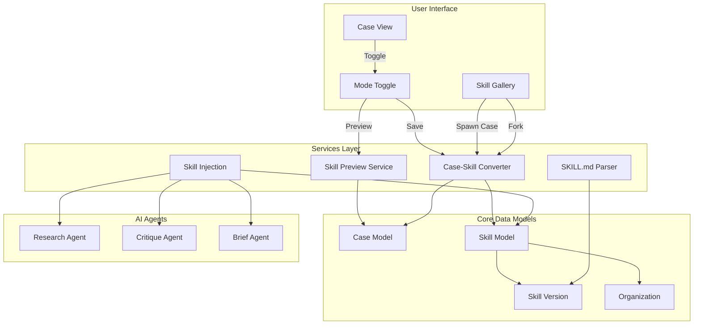
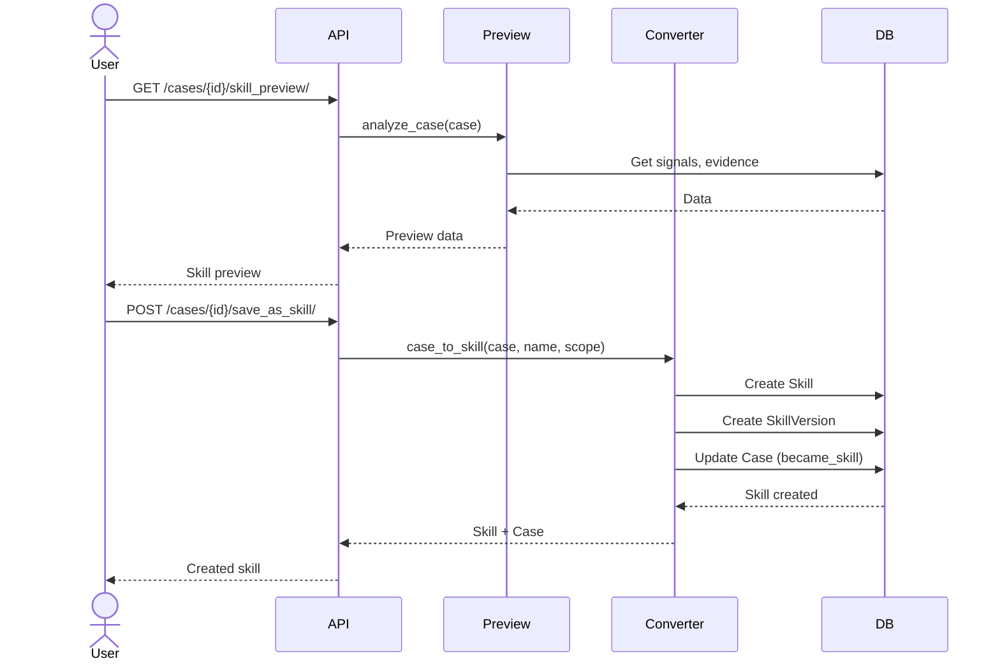
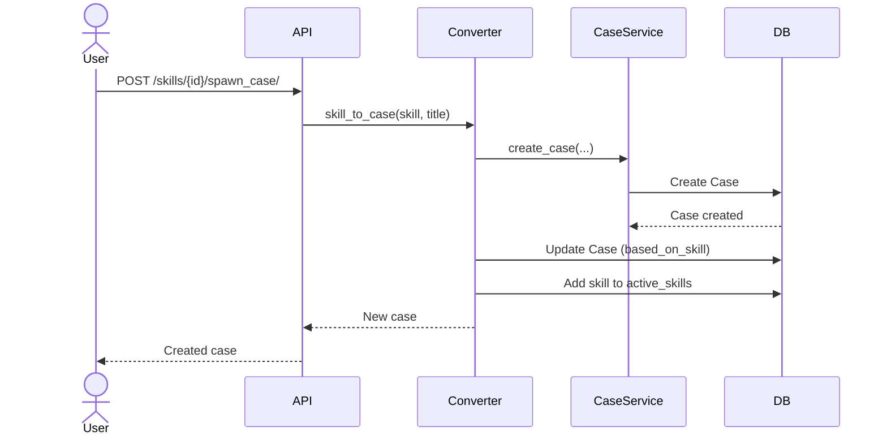
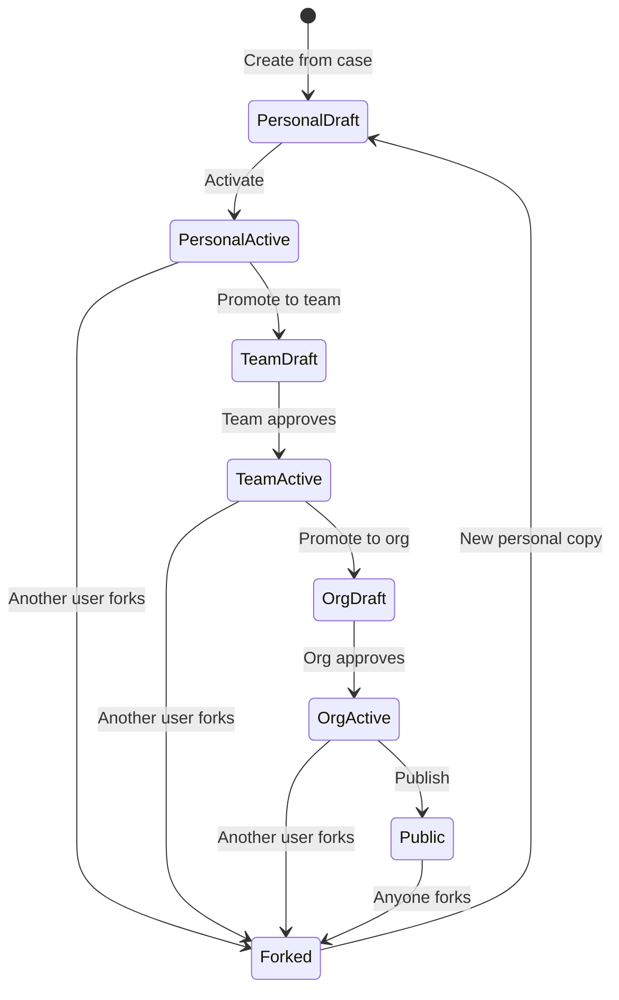

# Skill System Architecture

Complete architecture documentation for Episteme's unified Case-Skill system.

---

## System Overview



---

## Data Model Detail

### Case Model Fields

```
Case
├── Core Fields
│   ├── id (UUID)
│   ├── title (str)
│   ├── position (text)
│   ├── status (draft/active/archived)
│   └── stakes (low/medium/high)
│
├── Relationships
│   ├── user (ForeignKey)
│   ├── project (ForeignKey)
│   └── linked_thread (ForeignKey)
│
├── Skill Template Mode (NEW)
│   ├── is_skill_template (bool)
│   ├── template_scope (personal/team/org)
│   ├── based_on_skill (ForeignKey)
│   └── became_skill (OneToOne)
│
└── Many-to-Many
    └── active_skills (Skill[])
```

### Skill Model Fields

```
Skill
├── Ownership (NEW)
│   ├── scope (personal/team/org/public)
│   ├── owner (ForeignKey to User) *required*
│   ├── organization (ForeignKey, nullable)
│   └── team (ForeignKey, nullable)
│
├── Metadata (Anthropic Spec)
│   ├── name (str, max 64)
│   ├── description (str, max 200)
│   └── domain (str)
│
├── Config
│   ├── applies_to_agents (JSON: [str])
│   ├── episteme_config (JSON)
│   └── current_version (int)
│
├── Provenance (NEW)
│   ├── source_case (ForeignKey)
│   └── forked_from (ForeignKey to self)
│
├── Permissions (NEW)
│   ├── can_view (ManyToMany to User)
│   └── can_edit (ManyToMany to User)
│
└── Versioning
    └── versions (reverse: SkillVersion[])
```

---

## Request/Response Flow

### Converting Case to Skill



### Spawning Case from Skill



---

## Permission Matrix

| Skill Scope | Owner | Can View Users | Can Edit Users | Team Members | Org Members | Public |
|-------------|-------|----------------|----------------|--------------|-------------|--------|
| **Personal** |
| - View      | ✅    | ✅             | ✅             | ❌           | ❌          | ❌     |
| - Edit      | ✅    | ❌             | ✅             | ❌           | ❌          | ❌     |
| **Team** |
| - View      | ✅    | ✅             | ✅             | ✅           | ❌          | ❌     |
| - Edit      | ✅    | ❌             | ✅             | ❌           | ❌          | ❌     |
| **Organization** |
| - View      | ✅    | ✅             | ✅             | ✅           | ✅          | ❌     |
| - Edit      | ✅    | ❌             | ✅             | ❌           | ❌          | ❌     |
| **Public** |
| - View      | ✅    | ✅             | ✅             | ✅           | ✅          | ✅     |
| - Edit      | ✅    | ❌             | ✅             | ❌           | ❌          | ❌     |

---

## Skill Lifecycle



---

## Integration Points

### With Existing Systems

1. **Signal Extraction**:
   - Skills define custom signal types
   - Injected into extraction agent
   - Signals inherit skill-defined types

2. **Artifact Generation**:
   - Active skills automatically injected
   - Agents enhanced with domain knowledge
   - Generated artifacts track skills_used

3. **Case Management**:
   - Cases can toggle to skill mode
   - Skills can spawn new cases
   - Bi-directional provenance tracking

4. **Projects/Teams**:
   - Projects act as team boundaries
   - Team skills scoped to project
   - Project members see team skills

---

## File Organization

```
backend/apps/skills/
├── __init__.py
├── apps.py
├── models.py           # Skill, SkillVersion
├── serializers.py      # API serializers
├── views.py            # API endpoints
├── urls.py             # URL routing
├── parser.py           # SKILL.md parsing
├── injection.py        # Agent integration
├── preview.py          # Skill preview generation (NEW)
├── conversion.py       # Case-skill conversion (NEW)
├── permissions.py      # Multi-level access (NEW)
├── tests.py            # Test suite
├── README.md           # Documentation
├── examples/
│   ├── legal_decision_analysis.md
│   └── product_decision_framework.md
└── management/
    └── commands/
        └── load_example_skills.py
```

---

## Database Schema

### Tables

- `organizations` - Organization/team entities
- `skills` - Skill definitions
- `skill_versions` - Version history
- `cases` - Case entities (with skill template fields)
- `artifacts` - Generated artifacts
- `cases_active_skills` - M2M: Case → Skills
- `artifacts_skills_used` - M2M: Artifact → Skills
- `skills_can_view` - M2M: Skill → Users (view permission)
- `skills_can_edit` - M2M: Skill → Users (edit permission)

### Indexes

```sql
-- Skill indexes
CREATE INDEX idx_skills_scope_status ON skills(scope, status);
CREATE INDEX idx_skills_owner_scope ON skills(owner_id, scope);
CREATE INDEX idx_skills_org_scope ON skills(organization_id, scope);

-- Case indexes (existing + new)
CREATE INDEX idx_cases_is_template ON cases(is_skill_template);
CREATE INDEX idx_cases_based_on_skill ON cases(based_on_skill_id);
```

---

## Security Considerations

1. **Scope Enforcement**: Permission class validates scope access
2. **Owner Validation**: Only owner can promote or delete
3. **Fork Isolation**: Forked skills are independent (no shared state)
4. **Version Immutability**: Versions are append-only (no edits)
5. **Audit Trail**: All changes create new versions with changelog

---

## Performance Considerations

1. **Query Optimization**:
   - Use `select_related()` for skill.owner, skill.organization
   - Use `prefetch_related()` for can_view, can_edit
   - Index on scope, owner, organization

2. **Skill Loading**:
   - Progressive disclosure (only load when case has active skills)
   - Filter by agent type before loading content
   - Cache parsed SKILL.md in memory

3. **Preview Generation**:
   - Async-compatible for background jobs
   - Can be cached for frequently-toggled cases
   - Limit signal/evidence analysis to recent items

---

## Conclusion

This architecture enables:
- **Organic skill creation** from real work
- **Multi-level ownership** for collaboration
- **Bi-directional relationships** between cases and skills
- **Full provenance** tracking
- **Flexible permissions** for sharing

The unified model treats cases and skills as two modes of the same knowledge container, enabling fluid transitions and emergent knowledge capture.
