# Intelligent Agent Routing: LLM-Based Inflection Detection

## Design Philosophy: Mirror Case Suggestion Pattern

Your case suggestion system is brilliant:
- **Turn-based trigger** (4 turns)
- **LLM analysis** of conversation (last 8 messages)
- **Structured extraction** (confidence-scored)
- **User approval** before action

We'll use the same pattern for agent routing.

---

## The Inflection Point Detector

### What Are Inflection Points?

Moments in conversation where the nature of work **fundamentally changes**:

```
Chatting about options (conversational)
          ↓ INFLECTION POINT
Deep analysis needed (agent-worthy)

Exploring assumptions (brainstorming)
          ↓ INFLECTION POINT
Rigorous critique needed (agent-worthy)

Discussing findings (scattered)
          ↓ INFLECTION POINT  
Decision synthesis needed (agent-worthy)
```

---

## Architecture: Parallel to Case Suggestions

### Case Suggestions (Current)
```
4 turns → Analyze conversation → Extract decision components → Suggest case creation
```

### Agent Suggestions (New)
```
Continuous monitoring → Analyze conversation → Detect inflection points → Suggest agent
```

---

## Implementation Design

### 1. Inflection Point Detection Service

**File**: `backend/apps/agents/inflection_detector.py` (new)

```python
"""
LLM-based inflection point detection for agent routing.

Mirrors the case suggestion pattern but detects when specialized agents should engage.
"""
from typing import Dict, List, Optional
from apps.chat.models import Message, ChatThread
from apps.common.llm_providers import get_llm_provider
import json


class InflectionDetector:
    """
    Detects conversation inflection points where agents would be valuable.
    
    Uses LLM analysis (like case suggestions) rather than regex routing.
    """
    
    @staticmethod
    async def analyze_for_agent_need(
        thread: ChatThread,
        recent_messages: Optional[List[Message]] = None
    ) -> Dict:
        """
        Analyze conversation to detect if an agent would be helpful.
        
        Similar to analyze_for_case but focused on agent routing.
        
        Args:
            thread: Chat thread
            recent_messages: Optional specific messages (defaults to last 6)
        
        Returns:
            {
                'needs_agent': bool,
                'suggested_agent': str,  # 'research' | 'critique' | 'brief' | None
                'confidence': float,
                'inflection_type': str,
                'reasoning': str,
                'suggested_topic': str,  # For research agent
                'suggested_target': str,  # For critique agent
                'context_summary': str
            }
        """
        if recent_messages is None:
            messages = list(
                Message.objects.filter(thread=thread).order_by('created_at')
            )
            recent_messages = messages[max(0, len(messages)-6):]
        
        if len(recent_messages) < 2:
            return {
                'needs_agent': False,
                'suggested_agent': None,
                'confidence': 0.0,
                'inflection_type': 'insufficient_context',
                'reasoning': 'Need at least 2 messages to detect inflection'
            }
        
        # Build conversation context
        conversation_text = "\n\n".join([
            f"{m.role.upper()}: {m.content}"
            for m in recent_messages
        ])
        
        # LLM analysis
        provider = get_llm_provider('fast')  # Use same fast model as case suggestions
        
        system_prompt = """You are an expert at detecting conversation inflection points.

An inflection point is when conversation shifts from casual discussion to needing specialized analysis.

You identify THREE types of inflection points:
1. RESEARCH needed: User needs comprehensive information gathering, evidence synthesis, multi-source analysis
2. CRITIQUE needed: User needs assumptions challenged, risks identified, counterarguments explored
3. BRIEF needed: User has gathered info and needs synthesis, recommendation, decision framework

Respond ONLY with valid JSON."""

        user_prompt = f"""Analyze this conversation for inflection points:

{conversation_text}

Detect if a specialized agent would help at this point. Consider:
- Has the conversation shifted from casual to analytical?
- Is the user asking for deep analysis beyond simple Q&A?
- Are they exploring a complex decision space?
- Do they need synthesis or critique?

Extract:
1. needs_agent: true/false (is this an inflection point?)
2. suggested_agent: "research" | "critique" | "brief" | null
3. confidence: 0.0-1.0 (how certain are you?)
4. inflection_type: "research_depth" | "critique_assumptions" | "synthesis_decision" | "none"
5. reasoning: Brief explanation (1-2 sentences)
6. suggested_topic: If research agent, what topic? (or empty string)
7. suggested_target: If critique agent, what to critique? (or empty string)
8. context_summary: 1 sentence summarizing conversation state

Return ONLY valid JSON:
{{"needs_agent": true, "suggested_agent": "research", "confidence": 0.85, "inflection_type": "research_depth", "reasoning": "...", "suggested_topic": "...", "suggested_target": "", "context_summary": "..."}}"""
        
        full_response = ""
        async for chunk in provider.stream_chat(
            messages=[{"role": "user", "content": user_prompt}],
            system_prompt=system_prompt
        ):
            full_response += chunk.content
        
        try:
            analysis = json.loads(full_response.strip())
        except json.JSONDecodeError:
            # Fallback if JSON parsing fails
            return {
                'needs_agent': False,
                'suggested_agent': None,
                'confidence': 0.0,
                'inflection_type': 'parsing_error',
                'reasoning': 'Failed to parse LLM response'
            }
        
        return analysis
```

---

## Trigger Strategy: Continuous + Threshold-Based

### Similar to Signal Extraction Batching

```python
# Add to ChatThread model
class ChatThread(models.Model):
    # ... existing fields ...
    
    # Agent routing state (similar to signal extraction counters)
    turns_since_agent_check = models.IntegerField(default=0)
    last_agent_check_at = models.DateTimeField(null=True, blank=True)
    last_suggested_agent = models.CharField(max_length=20, blank=True)


# In assistant response workflow
async def assistant_response_workflow(thread_id, user_message_id):
    thread = await ChatThread.objects.aget(id=thread_id)
    
    # Increment counter
    thread.turns_since_agent_check += 1
    
    # Check thresholds (similar to signal extraction)
    AGENT_CHECK_THRESHOLD = 3  # Check every 3 turns
    
    should_check = (
        thread.turns_since_agent_check >= AGENT_CHECK_THRESHOLD or
        thread.last_agent_check_at is None
    )
    
    if should_check:
        # Run inflection detection
        from apps.agents.inflection_detector import InflectionDetector
        
        inflection = await InflectionDetector.analyze_for_agent_need(thread)
        
        # Emit event
        EventService.append(
            'CONVERSATION_ANALYZED_FOR_AGENT',
            payload=inflection,
            thread_id=thread.id
        )
        
        # Reset counter
        thread.turns_since_agent_check = 0
        thread.last_agent_check_at = timezone.now()
        await thread.asave()
        
        # If high confidence, create suggestion message
        if inflection['needs_agent'] and inflection['confidence'] > 0.75:
            await create_agent_suggestion_message(thread, inflection)
```

---

## Agent Suggestion Messages (Inline Cards)

### Design: Similar to Case Suggestion UI

```python
async def create_agent_suggestion_message(thread: ChatThread, inflection: Dict):
    """
    Create an inline agent suggestion message
    
    This is like the case suggestion card but for agents.
    """
    agent_type = inflection['suggested_agent']
    
    # Build suggestion text
    suggestion_text = f"""💡 **Agent Suggestion**

I've detected an inflection point: {inflection['inflection_type']}

**Suggested Agent**: {agent_type.title()}

**What it would do**:
"""
    
    if agent_type == 'research':
        suggestion_text += f"Research: {inflection['suggested_topic']}\n"
        suggestion_text += "- Gather comprehensive information\n"
        suggestion_text += "- Synthesize from multiple sources\n"
        suggestion_text += "- Apply active skills\n"
    elif agent_type == 'critique':
        suggestion_text += f"Critique: {inflection['suggested_target']}\n"
        suggestion_text += "- Challenge assumptions\n"
        suggestion_text += "- Identify risks\n"
        suggestion_text += "- Explore counterarguments\n"
    elif agent_type == 'brief':
        suggestion_text += "- Synthesize findings\n"
        suggestion_text += "- Generate recommendation\n"
        suggestion_text += "- Structure for decision\n"
    
    # Add skill info if case has active skills
    if thread.primary_case:
        active_skills = await thread.primary_case.active_skills.filter(status='active').acount()
        if active_skills > 0:
            skill_names = [
                s.name async for s in thread.primary_case.active_skills.filter(status='active')
            ]
            suggestion_text += f"\n**Using skills**: {', '.join(skill_names)}\n"
    
    suggestion_text += f"\n**Confidence**: {inflection['confidence']:.0%}"
    suggestion_text += f"\n\n_Reasoning_: {inflection['reasoning']}"
    
    # Create message with special metadata
    suggestion_msg = await ChatService.create_assistant_message(
        thread=thread,
        content=suggestion_text,
        metadata={
            'type': 'agent_suggestion',
            'agent_type': agent_type,
            'inflection': inflection,
            'awaiting_confirmation': True
        }
    )
    
    return suggestion_msg
```

---

## User Confirmation Detection

### Natural Language Confirmation (No Buttons in Backend)

```python
async def check_for_agent_confirmation(thread: ChatThread, user_message: Message) -> Optional[Dict]:
    """
    Check if user message is confirming a pending agent suggestion.
    
    Uses LLM to detect confirmation (more flexible than keyword matching).
    """
    # Get last assistant message
    last_assistant = await Message.objects.filter(
        thread=thread,
        role='ASSISTANT'
    ).order_by('-created_at').afirst()
    
    if not last_assistant:
        return None
    
    # Check if it's an agent suggestion
    if last_assistant.metadata.get('type') != 'agent_suggestion':
        return None
    
    if not last_assistant.metadata.get('awaiting_confirmation'):
        return None
    
    # Use LLM to detect confirmation
    provider = get_llm_provider('fast')
    
    prompt = f"""The assistant suggested running an agent. The user responded: "{user_message.content}"

Is the user:
A) Confirming (yes, sure, do it, go ahead, etc.)
B) Declining (no, skip, not now, etc.)  
C) Asking clarification (what would that do?, how long?, etc.)
D) Ignoring (continuing conversation on different topic)

Return ONLY: {{"intent": "confirm"|"decline"|"clarify"|"ignore"}}"""
    
    response = ""
    async for chunk in provider.stream_chat(
        messages=[{"role": "user", "content": prompt}],
        system_prompt="You detect user intent from responses."
    ):
        response += chunk.content
    
    try:
        result = json.loads(response.strip())
        intent = result['intent']
    except:
        return None
    
    if intent == 'confirm':
        return {
            'confirmed': True,
            'agent_type': last_assistant.metadata['agent_type'],
            'inflection': last_assistant.metadata['inflection']
        }
    elif intent == 'decline':
        # Mark as declined
        last_assistant.metadata['awaiting_confirmation'] = False
        await last_assistant.asave()
        return None
    else:
        # Clarify or ignore - keep suggestion active
        return None
```

---

## Complete Flow: LLM-Based Routing

```mermaid
sequenceDiagram
    actor User
    participant Chat
    participant Inflection
    participant LLM
    participant Agent
    participant Event
    
    User->>Chat: Message (turn 3)
    Chat->>Chat: Increment turn counter
    Chat->>Chat: Check threshold (3 turns)
    
    alt Threshold Met
        Chat->>Inflection: analyze_for_agent_need()
        Inflection->>LLM: Analyze last 6 messages
        
        LLM->>LLM: Detect patterns:
        Note over LLM: - Depth of questions<br/>- Complexity signals<br/>- Decision context<br/>- Analytical need
        
        LLM-->>Inflection: Analysis JSON
        
        alt High Confidence (>0.75)
            Inflection->>Chat: Create suggestion message
            Chat->>Event: ANALYZED_FOR_AGENT
            Chat-->>User: "💡 Run research agent?"
            
            User->>Chat: "Yes, do it"
            Chat->>LLM: Detect confirmation intent
            LLM-->>Chat: intent=confirm
            
            Chat->>Agent: Spawn with context
            Agent->>Event: Progress updates
            Agent-->>Chat: Results inline
        else Low Confidence
            Inflection->>Chat: Continue normal flow
            Chat->>LLM: Regular response
            LLM-->>User: Answer
        end
    else Below Threshold
        Chat->>LLM: Regular response
        LLM-->>User: Answer
    end
```



---

## Inflection Types and Agent Mapping

### Detected Patterns → Agent Selection

```python
INFLECTION_PATTERNS = {
    'research_depth': {
        'agent': 'research',
        'signals': [
            'User asks for comprehensive analysis',
            'Multiple complex questions',
            'Needs evidence from various sources',
            'Exploring unfamiliar territory'
        ],
        'example': 'User: "I need to understand all FDA pathways for medical devices"'
    },
    
    'critique_assumptions': {
        'agent': 'critique',
        'signals': [
            'User has formed position',
            'Mentions assumptions',
            'Needs validation',
            'Asks "what am I missing?"'
        ],
        'example': 'User: "I think 510(k) is our path. What risks am I not seeing?"'
    },
    
    'synthesis_decision': {
        'agent': 'brief',
        'signals': [
            'User has gathered information',
            'Multiple perspectives discussed',
            'Ready to decide',
            'Asks for recommendation'
        ],
        'example': 'User: "We\'ve discussed options. What should we do?"'
    },
    
    'none': {
        'agent': None,
        'signals': [
            'Simple question',
            'Clarification',
            'Social chat',
            'Single-turn need'
        ],
        'example': 'User: "Thanks!" or "What does 510(k) stand for?"'
    }
}
```

### LLM Prompt for Detection

```python
INFLECTION_DETECTION_PROMPT = """Analyze this conversation for inflection points.

CONVERSATION:
{conversation_text}

CONTEXT:
- Thread has case: {has_case}
- Active skills: {skill_names}
- Previous agent runs: {agent_history}

INFLECTION TYPES TO DETECT:

1. **research_depth**: Shift from simple Q&A to needing comprehensive analysis
   Signals: Multiple questions, unfamiliar territory, need evidence, exploring options
   
2. **critique_assumptions**: Shift from forming ideas to needing validation
   Signals: Position stated, assumptions mentioned, seeking challenges, "what am I missing?"
   
3. **synthesis_decision**: Shift from gathering info to needing decision framework
   Signals: Info collected, perspectives discussed, asking for recommendation, "what should we do?"
   
4. **none**: Continue conversational flow, no agent needed
   Signals: Simple questions, clarifications, social responses, single facts

DETECTION RULES:
- Confidence > 0.75: Strong inflection detected
- Confidence 0.5-0.75: Possible inflection, suggest tentatively
- Confidence < 0.5: No clear inflection, continue conversation

Extract:
1. needs_agent: true if confidence > 0.5
2. suggested_agent: "research" | "critique" | "brief" | null
3. confidence: 0.0-1.0
4. inflection_type: Which pattern detected
5. reasoning: Why you detected this (2-3 sentences)
6. suggested_topic: For research agent, what to research
7. suggested_target: For critique agent, what to critique
8. context_summary: Current state of conversation (1 sentence)

Return ONLY valid JSON."""
```

---

## Integration with Existing Workflow

### Update: `assistant_response_workflow`

**File**: `backend/tasks/workflows.py`

```python
@shared_task
async def assistant_response_workflow(thread_id, user_message_id):
    """
    Enhanced with inflection detection (parallels case suggestion)
    """
    thread = await ChatThread.objects.aget(id=thread_id)
    user_message = await Message.objects.aget(id=user_message_id)
    
    # Increment agent check counter
    thread.turns_since_agent_check = (thread.turns_since_agent_check or 0) + 1
    
    # Check if we should analyze for agents (every 3 turns)
    AGENT_CHECK_INTERVAL = 3
    
    should_analyze = (
        thread.turns_since_agent_check >= AGENT_CHECK_INTERVAL or
        thread.last_agent_check_at is None
    )
    
    if should_analyze:
        from apps.agents.inflection_detector import InflectionDetector
        
        # Analyze for inflection points
        inflection = await InflectionDetector.analyze_for_agent_need(thread)
        
        # Emit event for tracking
        EventService.append(
            'CONVERSATION_ANALYZED_FOR_AGENT',
            payload=inflection,
            thread_id=thread.id,
            case_id=thread.primary_case.id if thread.primary_case else None
        )
        
        # Reset counter
        thread.turns_since_agent_check = 0
        thread.last_agent_check_at = timezone.now()
        
        # If high confidence, create suggestion
        if inflection['needs_agent'] and inflection['confidence'] > 0.75:
            # Store pending suggestion
            thread.metadata = thread.metadata or {}
            thread.metadata['pending_agent_suggestion'] = inflection
            
            # Create suggestion message
            from apps.agents.messages import create_agent_suggestion_message
            await create_agent_suggestion_message(thread, inflection)
            
            await thread.asave()
            return {'status': 'agent_suggested'}
    
    # Check for confirmation of previous suggestion
    if thread.metadata and thread.metadata.get('pending_agent_suggestion'):
        from apps.agents.confirmation import check_for_agent_confirmation
        
        confirmation = await check_for_agent_confirmation(thread, user_message)
        
        if confirmation and confirmation['confirmed']:
            # User confirmed! Spawn agent
            from apps.agents.orchestrator import AgentOrchestrator
            
            await AgentOrchestrator.run_agent_in_chat(
                thread=thread,
                agent_type=confirmation['agent_type'],
                user=thread.user,
                params=confirmation['params']
            )
            
            # Clear pending
            thread.metadata['pending_agent_suggestion'] = None
            await thread.asave()
            
            return {'status': 'agent_spawned'}
    
    # Normal response flow
    response = await ChatService.generate_assistant_response(thread)
    
    # ... rest of existing workflow (signal extraction, etc.)
```

---

## Advantages Over Regex Routing

| Aspect | Regex Routing | LLM-Based Inflection Detection |
|--------|---------------|-------------------------------|
| **Accuracy** | Brittle, misses variations | Semantic understanding |
| **Maintenance** | Manual pattern updates | Self-improving |
| **Context** | Keyword-based only | Full conversation awareness |
| **False positives** | High (matches literal words) | Low (understands intent) |
| **Adaptability** | Requires code changes | Learns from usage |
| **Explainability** | "Matched pattern X" | "Reasoning: User shifted to analytical mode..." |

---

## Learning from Usage (Future Enhancement)

### Track Agent Suggestion Outcomes

```python
class AgentSuggestionOutcome(models.Model):
    """Track if agent suggestions were helpful"""
    
    thread = models.ForeignKey(ChatThread)
    suggested_agent = models.CharField(max_length=20)
    confidence = models.FloatField()
    inflection_type = models.CharField(max_length=50)
    
    # Outcome
    user_accepted = models.BooleanField()
    user_feedback = models.CharField(
        max_length=20,
        choices=[
            ('helpful', 'Helpful'),
            ('not_needed', 'Not Needed'),
            ('wrong_agent', 'Wrong Agent Type'),
            ('too_early', 'Too Early'),
            ('too_late', 'Too Late')
        ],
        null=True, blank=True
    )
    
    # Improve detection over time
    # Use this data to fine-tune confidence thresholds
    # Analyze: Which inflection_types have high acceptance rates?
```

---

## Configuration and Tuning

### Adjustable Parameters (Environment Variables)

```python
# In settings.py
AGENT_ROUTING_CONFIG = {
    # How often to check for inflections
    'check_interval_turns': env.int('AGENT_CHECK_INTERVAL', default=3),
    
    # Confidence thresholds
    'min_confidence_to_suggest': env.float('AGENT_MIN_CONFIDENCE', default=0.75),
    'min_confidence_to_auto_run': env.float('AGENT_AUTO_RUN_CONFIDENCE', default=0.95),
    
    # Context window
    'analysis_message_count': env.int('AGENT_ANALYSIS_MESSAGES', default=6),
    
    # LLM provider
    'detection_model': env('AGENT_DETECTION_MODEL', default='openai:gpt-4o-mini'),
    
    # Feature flags
    'enable_auto_suggestions': env.bool('AGENT_AUTO_SUGGEST', default=True),
    'enable_auto_run': env.bool('AGENT_AUTO_RUN', default=False),  # Risky!
}
```

---

## Frontend Integration

### React Hook for Agent Suggestions

```typescript
// useAgentSuggestions.ts
export function useAgentSuggestions(threadId: string) {
  const [suggestion, setSuggestion] = useState<AgentSuggestion | null>(null)
  const [isRunning, setIsRunning] = useState(false)
  
  // Listen for suggestion messages
  useEffect(() => {
    const checkForSuggestions = () => {
      // Filter messages for agent_suggestion type
      const suggestionMsg = messages.find(
        m => m.metadata?.type === 'agent_suggestion' &&
             m.metadata?.awaiting_confirmation
      )
      
      if (suggestionMsg) {
        setSuggestion({
          messageId: suggestionMsg.id,
          agentType: suggestionMsg.metadata.agent_type,
          inflection: suggestionMsg.metadata.inflection
        })
      }
    }
    
    checkForSuggestions()
  }, [messages])
  
  const confirmAgent = async () => {
    setIsRunning(true)
    
    // Send confirmation message
    await api.post(`/chat/threads/${threadId}/messages/`, {
      content: "Yes, run the agent",
      // Backend will detect this as confirmation
    })
  }
  
  const declineAgent = async () => {
    await api.post(`/chat/threads/${threadId}/messages/`, {
      content: "No thanks, just continue normally"
    })
    setSuggestion(null)
  }
  
  return { suggestion, confirmAgent, declineAgent, isRunning }
}
```

### UI Component

```tsx
function AgentSuggestionCard({ suggestion, onConfirm, onDecline }) {
  return (
    <div className="agent-suggestion-card">
      <div className="icon">💡</div>
      <div className="content">
        <h4>Run {suggestion.agentType} Agent?</h4>
        <p>{suggestion.inflection.reasoning}</p>
        
        {suggestion.inflection.suggested_topic && (
          <p className="topic">
            Topic: <strong>{suggestion.inflection.suggested_topic}</strong>
          </p>
        )}
        
        <div className="confidence">
          Confidence: {(suggestion.inflection.confidence * 100).toFixed(0)}%
        </div>
      </div>
      
      <div className="actions">
        <Button onClick={onConfirm} variant="primary">
          Run Agent
        </Button>
        <Button onClick={onDecline} variant="ghost">
          Continue Chatting
        </Button>
      </div>
    </div>
  )
}
```

---

## Summary: Key Design Decisions

### 1. LLM-Based Detection (Not Regex)
- Analyzes conversation semantically
- Understands context and intent
- Provides reasoning for suggestions

### 2. Turn-Based Triggers (Like Case Suggestions)
- Check every 3 turns
- Analyze last 6 messages
- Threshold-based to avoid over-suggesting

### 3. Confidence Scoring
- 0.75+ → Suggest to user
- 0.5-0.75 → Maybe mention inline
- <0.5 → Continue conversation

### 4. User Approval (Always)
- Never auto-spawn agents (unless confidence >0.95 and user opts in)
- Always show reasoning
- Natural language confirmation detection

### 5. Skill Auto-Loading
- If thread has case → Load case active skills
- If no case → Load user's personal skills matching domain
- Multi-user skills compose automatically

### 6. Inline Results
- Agent results appear as chat messages
- Expandable artifact previews
- Can save separately if desired

---

## Implementation Plan

Want me to implement this? I would create:

1. **InflectionDetector** - LLM-based inflection point analysis
2. **AgentConfirmation** - Natural language confirmation detection
3. **AgentOrchestrator** - Spawn and track agents
4. **Workflow Integration** - Hook into `assistant_response_workflow`
5. **Event System** - New event types for agent lifecycle
6. **API Endpoints** - Invoke agent, check progress

This creates intelligent routing that learns conversation patterns, not brittle regex matching!